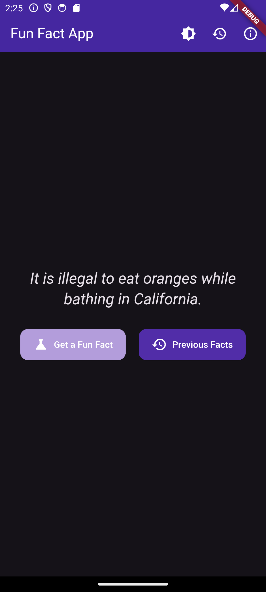
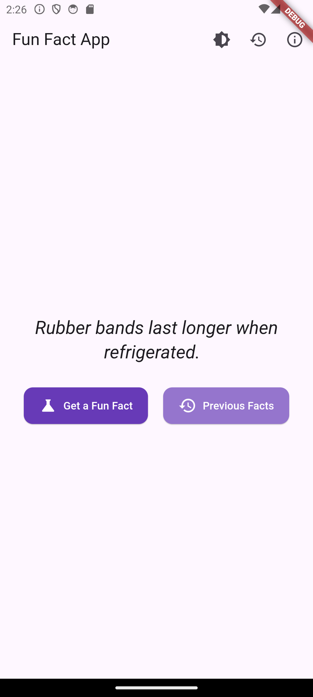
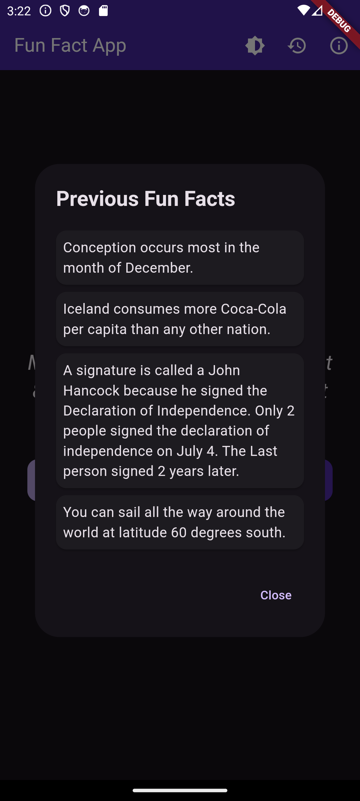

# Fun Fact App

A new Flutter project. Trying Flutter for the first time.....

## Getting Started

This project is a starting point for a Flutter application.

### Prerequisites

Before you begin, ensure you have met the following requirements:
- You have installed the latest version of [Flutter](https://flutter.dev/docs/get-started/install).
- You have a basic understanding of Dart and Flutter.

### Installing

To get a local copy up and running, follow these simple steps:

1. **Clone the repository**:
   ```sh
   git clone https://github.com/Kubomu/FlutterApps.git
   ```

2. **Install dependencies**:
   ```sh
   flutter pub get
   ```

3. **Run the app**:
   ```sh
   flutter run
   ```

### Usage

This project is a simple Flutter application that displays fun facts. You can use it as a starting point for your own Flutter projects.

### Features

- Fetch and display fun facts.
- Share fun facts on social media.
- View previous fun facts.
- Toggle between light and dark themes.

## Screenshots

### Home Screen


### Fact Screen


### Previous facts



### Contributing


Contributions are what make the open-source community such an amazing place to learn, inspire, and create. Any contributions you make are **greatly appreciated**.

1. Fork the Project
2. Create your Feature Branch (`git checkout -b feature/AmazingFeature`)
3. Commit your Changes (`git commit -m 'Add some AmazingFeature'`)
4. Push to the Branch (`git push origin feature/AmazingFeature`)
5. Open a Pull Request

### License

Distributed under the MIT License. See `LICENSE` for more information.

### Contact

Kubomu Edwin - [@Kubomu](https://github.com/Kubomu) - kubomuedwin@example.com

Project Link: [https://github.com/Kubomu/FlutterApps](https://github.com/Kubomu/FlutterApps)

### Acknowledgments

- Hat tip to anyone whose code was used
- Inspiration
- etc.

## Resources

A few resources to get you started if this is your first Flutter project:

- [Lab: Write your first Flutter app](https://docs.flutter.dev/get-started/codelab)
- [Cookbook: Useful Flutter samples](https://docs.flutter.dev/cookbook)

For help getting started with Flutter development, view the [online documentation](https://docs.flutter.dev/), which offers tutorials, samples, guidance on mobile development, and a full API reference.
```

### Explanation of Sections

1. **Getting Started**:
   - Provides an overview of the project and instructions on how to set it up.

2. **Prerequisites**:
   - Lists the requirements needed before setting up the project.

3. **Installing**:
   - Step-by-step instructions on how to clone the repository, navigate to the project directory, install dependencies, and run the app.

4. **Usage**:
   - Describes what the project does and how to use it.

5. **Features**:
   - Lists the key features of the app.

6. **Contributing**:
   - Guidelines for contributing to the project.

7. **License**:
   - Information about the project's license.

8. **Contact**:
   - Contact information for the project maintainer.

9. **Acknowledgments**:
   - Acknowledgments for any code, inspiration, etc.

10. **Resources**:
    - Additional resources for learning Flutter.


